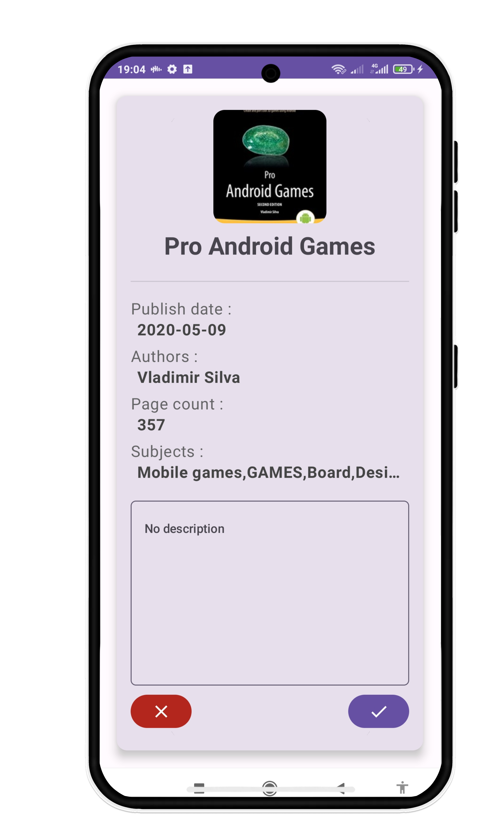
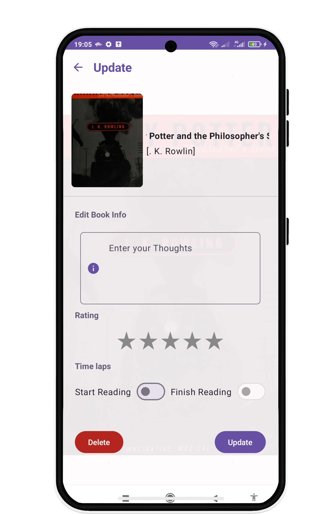
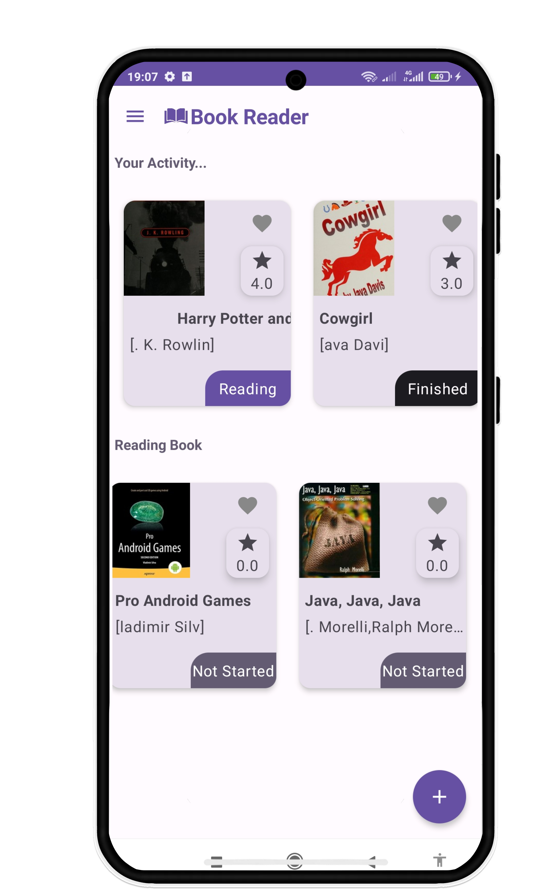
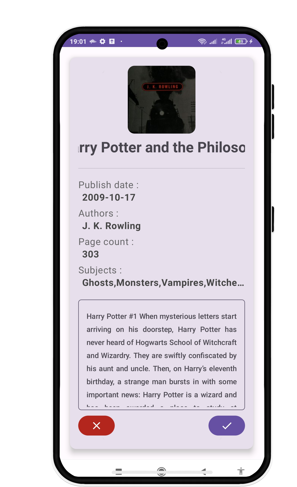
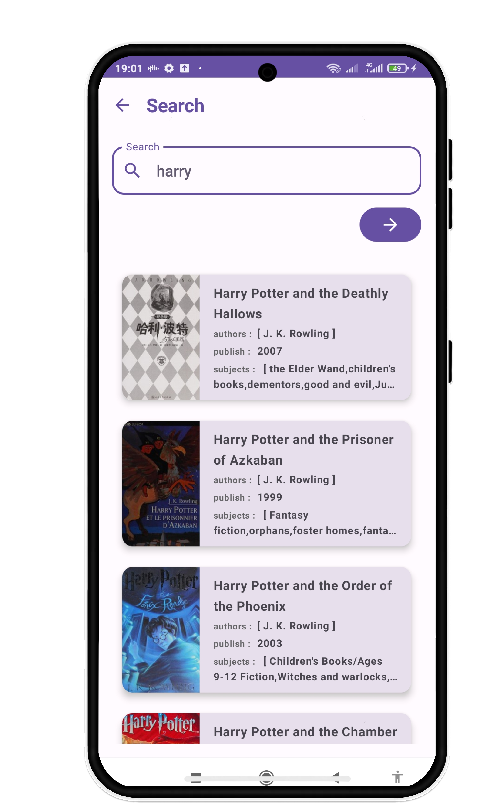

# Book Reader App

___
Book Reader is a versatile Android application built using Jetpack Compose that caters to book enthusiasts. With the
ability to manage your reading list, synchronize books using the Supabase API, and locally store them with Room
Database, Book Reader takes your reading experience to the next level. Whether you're embarking on a new literary
journey, actively engrossed in reading, or savoring a completed book, Book Reader has all the features you need.

### App Demo

### Features

* Remote and Local Storage: Safeguard your book collection on Supabase and locally using Room Database.
* Reading Progress: Organize your books into "Not Started," "Reading," and "Finished" categories.
* Book Search: Effortlessly find books by exploring the api library.
* User Authentication: Ensure the security of your reading data with user authentication provided by Supabase.
* Rating and Reviews: Rate and compose reviews for the books you've delved into, saving them to Supabase.
* Choose from a Wide Selection
* Book Reader boasts an expansive list of books fetched from APIs, ensuring you have access to a diverse range of
  reading options. This empowers you to discover, explore, and select books that cater to your unique reading
  preferences. Whether you're into fiction, non-fiction, fantasy, romance, or any other genre, Book Reader has something
  special waiting for you.

### Prerequisites

Before getting started, ensure you have the following:

* Android Studio installed on your machine.
* Android device/emulator.

### Installation

* Clone the repository:
  `git clone <repository_url>`
* Open Android Studio and choose "Open an Existing Project."
* Navigate to the cloned project directory and select it.

### Usage

Follow these steps to effectively utilize Book Reader:

* Build and run the app on an emulator or device.
* After launching, you'll be prompted to authenticate using your Supabase account or create one.
* Once logged in, you can start adding books to your reading list. Search for books using the integrated API search.
* Organize your books into categories like "Not Started," "Reading," and "Finished."
* Track your reading progress by updating the status of each book.
* Rate and review books by selecting a book card and providing your feedback.

### Contributing

Your contributions to Book Reader are welcomed! Whether it's bug fixes, new features, or improvements, feel free to open
issues or submit pull requests. Acknowledgments Book Reader leverages the power of Jetpack Compose for its modern and
intuitive user interface. Special thanks to the Supabase team for their powerful API that makes remote data management
seamless. License Book Reader is an educational project and is not affiliated with Supabase or any book services.